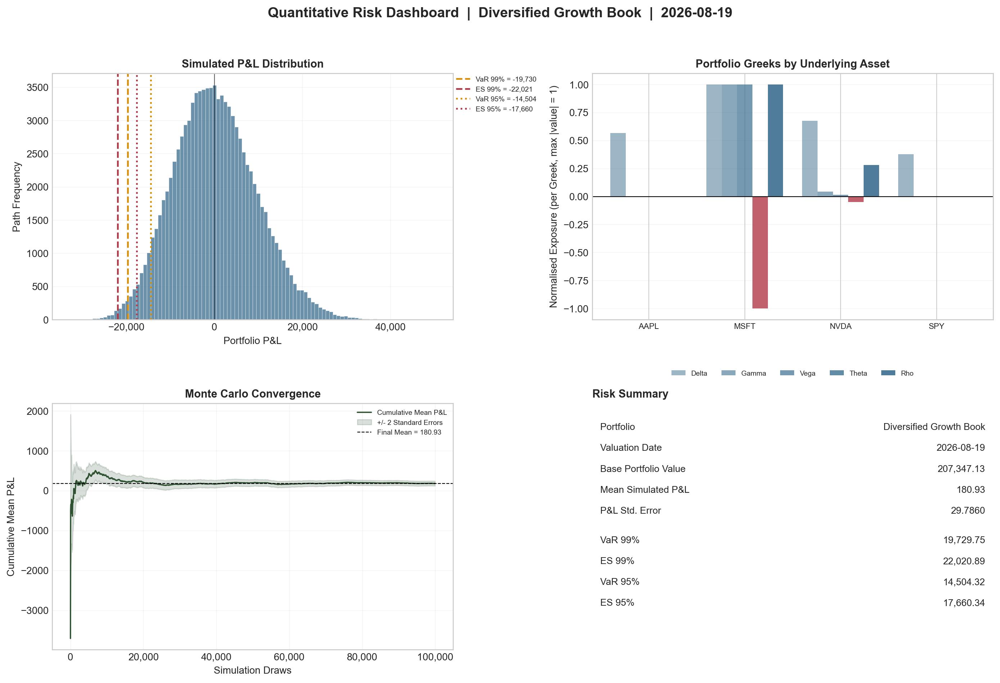
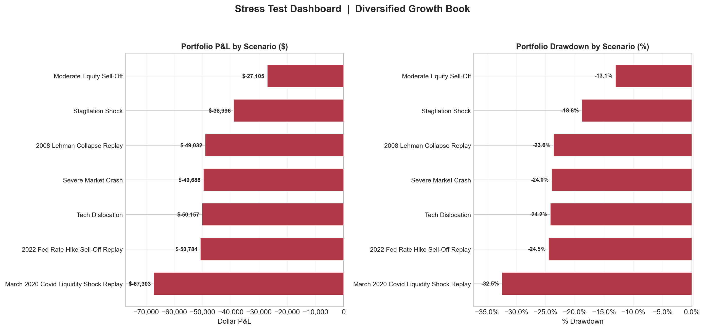

# Quantitative Risk Management Aggregator

A high-performance, full-revaluation market risk engine engineered to compute coherent tail-risk measures and stress dynamics for heterogeneous, multi-asset derivatives books. By replacing legacy first-order Taylor approximations with pathwise continuous-time repricing under correlated Geometric Brownian Motion, the system accurately captures non-linear Greek deformations, volatility surface shocks, and tail fatness under Basel III / FRTB regulatory standards.

---

## Executive Summary & Core Results

The engine executes full-revaluation Monte Carlo simulations across $M = 100,000$ paths on the reference *Diversified Growth Book* (Base NAV $\Pi_0 = 207,347.13\text{ USD}$). It benchmarks coherent Expected Shortfall ($\mathrm{ES}_\alpha$) against Value-at-Risk ($\mathrm{VaR}_\alpha$) and subjects the portfolio to a battery of multi-factor macro stress dislocations.

* **Read the Full Academic Whitepaper:** [Quantitative_Risk_Aggregator.pdf](report/Quantitative_Risk_Aggregator.pdf)

---

## Key Mathematical & Algorithmic Highlights

* **Correlated Multi-Asset GBM Diffusion:** Generates joint terminal price distributions $S_{i,T} = S_{i,0}\exp\left(\left(r - q_i - \frac{1}{2}\sigma_i^2\right)T + \sigma_i \sqrt{T} Z_i\right)$ using lower-triangular Cholesky factors $\mathbf{Z} = \mathbf{L}\boldsymbol{\varepsilon}$.
* **Higham (2002) Spectral PSD Repair:** Projects indefinite empirical correlation matrices onto the positive semi-definite cone $\mathcal{S}_+^N$ via spectral eigenvalue clipping $\widetilde{\mathbf{\Lambda}} = \mathrm{diag}(\max(\lambda_i, \epsilon))$ and diagonal normalization $\mathbf{\Sigma}_{\mathrm{PSD}} = \mathbf{D}^{-1/2}\widetilde{\mathbf{\Sigma}}\mathbf{D}^{-1/2}$, guaranteeing numerically stable Cholesky factorization.
* **Antithetic Variance Reduction:** Pairs correlated innovations $(\mathbf{Z}, -\mathbf{Z})$ across $M/2$ draws, leveraging non-positive covariance $\mathrm{Cov}(g(\mathbf{Z}), g(-\mathbf{Z})) \le 0$ to minimize estimator standard error at zero incremental random-number cost.
* **Exact Black–Scholes–Merton Vectorized Revaluation:** Eliminates Taylor-truncation error by pricing all linear equities and European option overlays analytically across an $(M \times K)$ tensor layout with zero per-path Python looping.
* **Rockafellar–Uryasev Variational Formulation:** Computes non-parametric $\mathrm{VaR}_\alpha$ via introselect order statistics ($L_{(\lceil M\alpha \rceil)}$) and solves $\mathrm{ES}_\alpha$ using convex optimization:
  $$\min_{\zeta \in \mathbb{R}} \left\{ \zeta + \frac{1}{1-\alpha}\mathbb{E}[(L - \zeta)^+] \right\}$$
* **Dynamic Delta Drift & Macro Stress Testing:** Quantifies non-linear Greek degradation under severe multi-factor shocks (e.g., March 2020 COVID Liquidity Shock: $-32.46\%$ drawdown, $-216.99$ Delta collapse).

---

## Visual Risk Analytics

### Full-Revaluation Quantitative Risk Dashboard


### Deterministic Macro Stress-Testing Dashboard


---

## Project Structure

```text
quant-risk-aggregator/
├── figures/
│   ├── risk_dashboard.png
│   └── stress_test_dashboard.png
├── report/
│   ├── main.tex
│   ├── references.bib
│   └── Quantitative_Risk_Aggregator.pdf
├── src/
│   ├── __init__.py
│   ├── data_models.py
│   ├── engine.py
│   ├── market_data_loader.py
│   ├── stress_testing.py
│   └── visualiser.py
├── tests/
│   ├── __init__.py
│   ├── test_engine.py
│   └── test_stress_testing.py
├── .gitignore
├── main.py
├── README.md
└── requirements.txt